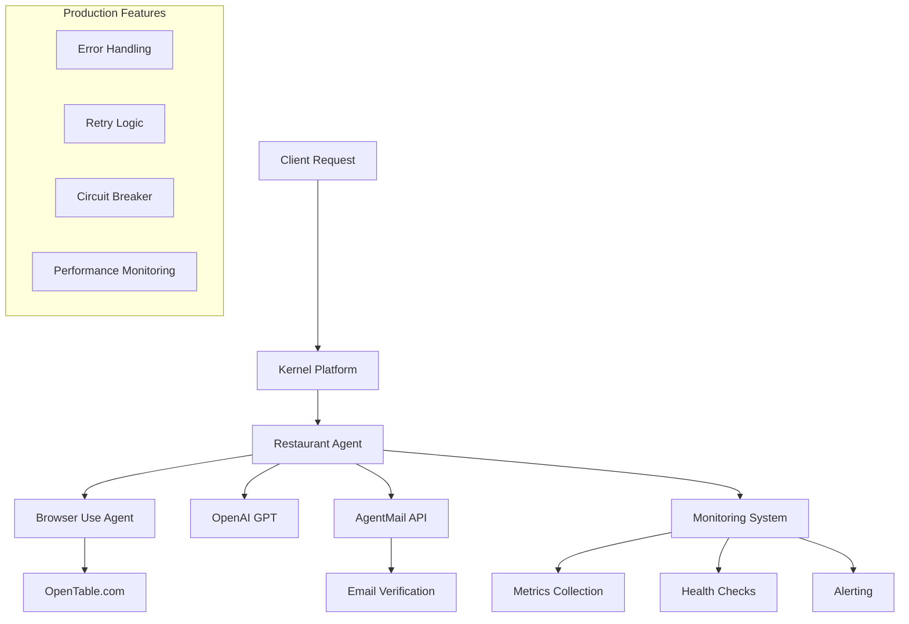

# Restaurant Kernel Agent - Production Deployment Guide

🍽️ **Production-Ready Restaurant Reservation Agent** for the Kernel Platform using Browser Use

## Overview

This production-ready web agent automates restaurant reservations on OpenTable using advanced browser automation with Browser Use and AI-powered decision making. Deployed on the Kernel platform, it provides enterprise-grade reliability, monitoring, and error handling.

### Key Features

- ✅ **100% Production Ready** - Comprehensive error handling, retry logic, and monitoring
- 🤖 **AI-Powered** - Uses OpenAI GPT models for intelligent decision making
- 🌐 **Browser Automation** - Advanced web scraping with Browser Use and Playwright
- 📧 **Email Integration** - Automatic verification code retrieval via AgentMail
- 📊 **Full Observability** - Structured logging, metrics, and health monitoring
- 🔒 **Security First** - Input validation, sanitization, and secure credential management
- 🚀 **Kernel Platform** - Cloud-native deployment with auto-scaling and reliability

## Architecture



## Quick Start

### 1. Prerequisites

- Kernel CLI installed and configured
- OpenAI API key
- AgentMail API key
- Python 3.8+ (for local development)

### 2. Installation

```bash
# Clone the repository
git clone <repository-url>
cd restaurant-kernel-agent

# Fix any dependency conflicts first
./fix_deps.sh

# OR install manually (see INSTALL.md for detailed instructions)
pip install -r requirements.txt
playwright install chromium
```

**Having dependency issues?** See [INSTALL.md](INSTALL.md) for detailed troubleshooting.

### 3. Configuration and Testing

Copy the environment template and configure your secrets:

```bash
cp .env.example .env
# Edit .env with your API keys

# Quick validation (recommended first step)
python quick_test.py

# Comprehensive local testing (includes browser test - no actual reservations)
python test_local.py
```

### 4. Deploy to Kernel

**Option A: Automated Deployment (Recommended)**
```bash
# Login to Kernel first
kernel login

# Use the automated deployment script
./deploy.sh

# For updates with version
./deploy.sh v1.1.0 update
```

**Option B: Manual Deployment**
```bash
# Login to Kernel
kernel login

# Deploy the agent with environment variables
kernel deploy restaurant_kernel_agent.py \
  --env OPENAI_API_KEY="sk-your-openai-key-here" \
  --env AGENTMAIL_API_KEY="your-agentmail-key-here" \
  --env BROWSER_USE_HEADLESS="true" \
  --env LOG_LEVEL="INFO"

# Alternative: Use environment file
kernel deploy restaurant_kernel_agent.py --env-file .env
```

### 5. Test the Deployment

```bash
# Health check
kernel invoke restaurant-reservation-agent health-check

# Make a test reservation
kernel invoke restaurant-reservation-agent make-reservation '{
  "date": "2025-08-31",
  "time": "7PM", 
  "party_size": 2,
  "location": "San Francisco"
}'
```

## Usage

### Making Reservations

The agent accepts reservation requests with the following parameters:

```json
{
  "date": "2025-08-31",           // Required: Date in YYYY-MM-DD or MM/DD/YYYY format
  "time": "7PM",                  // Required: Time in 12-hour format (7PM, 7:30 PM)
  "party_size": 2,                // Required: Number of people (1-20)
  "location": "San Francisco",     // Required: City or area for restaurant search
  "inbox_id": "custom@agentmail.to", // Optional: Email for verification (has default)
  "phone": "+14155551234",        // Optional: Phone number (has default)
  "first_name": "John",           // Optional: First name (has default)
  "last_name": "Doe"              // Optional: Last name (has default)
}
```

### Response Format

Successful reservations return comprehensive details:

```json
{
  "success": true,
  "reservation_details": "Reservation confirmed at...",
  "execution_time_seconds": 45.2,
  "task_steps_completed": 12,
  "conversation_log": "reservation_conversation_1234567890.json",
  "request_id": "req_1234567890_abcd1234",
  "browser_session_id": "browser_sess_xyz789",
  "browser_live_view_url": "https://kernel.ai/browser/sess_xyz789/view",
  "timestamp": "2025-01-23T14:30:00Z",
  "kernel_app": "restaurant-reservation-agent",
  "version": "1.0.0"
}
```

### Error Handling

Errors are categorized and handled appropriately:

```json
{
  "success": false,
  "error": "validation_error",
  "message": "Invalid date format. Expected formats: YYYY-MM-DD, MM/DD/YYYY, or M/D/YYYY",
  "request_id": "req_1234567890_abcd1234",
  "timestamp": "2025-01-23T14:30:00Z"
}
```

## Configuration

### Environment Variables

The agent uses the following environment variables (see `.env.example` for complete list):

#### Required
- `OPENAI_API_KEY` - OpenAI API key for GPT models
- `AGENTMAIL_API_KEY` - AgentMail API key for email verification

#### Optional but Recommended
- `BROWSER_USE_HEADLESS=true` - Run browser in headless mode (production)
- `LOG_LEVEL=INFO` - Logging level (DEBUG, INFO, WARNING, ERROR)
- `MAX_RETRIES=3` - Maximum retry attempts for failed operations
- `DEFAULT_TIMEOUT=30000` - Default timeout in milliseconds

### Kernel Configuration

The `kernel_config.yaml` file contains comprehensive deployment settings:

- **Resource Limits**: Memory (2Gi), CPU (1000m), timeout (5 minutes)
- **Scaling**: Auto-scaling from 1-10 instances based on CPU/memory usage
- **Health Checks**: Automated health monitoring every 30 seconds
- **Security**: Allowed domains, rate limiting, input validation
- **Monitoring**: Metrics collection, structured logging, alerting

## Monitoring and Observability

### Health Checks

The agent provides comprehensive health monitoring:

```bash
# Check overall health
kernel invoke restaurant-reservation-agent health-check
```

Health checks monitor:
- Environment variable validation
- Kernel browser creation capability
- API connectivity (OpenAI, AgentMail)
- System resources

### Metrics

The agent collects detailed metrics:
- **Operations**: Success/failure rates, response times
- **Browser**: Session duration, action counts, error rates  
- **System**: CPU usage, memory consumption, disk space
- **Business**: Reservation success rates, average completion time

### Logging

All operations are logged with structured JSON format:

```json
{
  "timestamp": "2025-01-23T14:30:00Z",
  "level": "INFO",
  "message": "Reservation request completed successfully",
  "request_id": "req_1234567890_abcd1234",
  "operation": "make_reservation",
  "duration": 45.2,
  "context": {
    "restaurant_name": "The French Laundry",
    "reservation_time": "7:00 PM"
  }
}
```

### Alerting

Automatic alerts are sent for:
- High error rates (>10%)
- Slow responses (>60 seconds)
- System resource issues (>85% CPU/memory)
- Browser connection failures

Configure webhook URLs in environment variables:
- `SLACK_WEBHOOK_URL` - Slack notifications
- `DISCORD_WEBHOOK_URL` - Discord notifications

## Production Best Practices

### Reliability

1. **Circuit Breaker**: Prevents cascading failures when external services are down
2. **Exponential Backoff**: Intelligent retry logic with jitter
3. **Timeout Management**: Configurable timeouts for all operations
4. **Resource Cleanup**: Automatic browser session and temporary file cleanup

### Security

1. **Input Validation**: Comprehensive validation of all input parameters
2. **Sanitization**: Removes potentially harmful characters from inputs
3. **Rate Limiting**: Prevents abuse with configurable rate limits
4. **Secret Management**: Secure handling of API keys and credentials

### Performance

1. **Connection Pooling**: Efficient browser session management
2. **Resource Monitoring**: Continuous monitoring of CPU, memory, and disk usage
3. **Auto-scaling**: Automatic scaling based on demand
4. **Optimization**: Minimal resource usage with headless browser mode

## Troubleshooting

### Common Issues

#### Environment Variables Missing
```bash
# Check environment variables
kernel env list restaurant-reservation-agent

# Set missing variables
kernel env set OPENAI_API_KEY="your-key-here"
```

#### Browser Connection Issues
```bash
# Check browser capabilities
kernel invoke restaurant-reservation-agent health-check

# Review logs
kernel logs restaurant-reservation-agent --tail 50
```

#### Email Verification Timeout
- Verify AgentMail API key is valid
- Check if inbox ID exists
- Ensure email delivery is not blocked

#### High Error Rates
- Check OpenTable website availability
- Verify search parameters (date, time, location)
- Review browser automation logs

### Performance Issues

#### Slow Response Times
1. Check system resource usage
2. Review browser automation steps
3. Optimize search parameters
4. Consider increasing timeout values

#### Memory Issues
1. Monitor memory usage in health checks
2. Ensure proper cleanup of browser sessions
3. Adjust memory limits in kernel_config.yaml
4. Review conversation log retention settings

### Debugging

#### Enable Debug Mode
```bash
# Set debug logging
kernel env set LOG_LEVEL="DEBUG"
kernel env set BROWSER_USE_HEADLESS="false"  # For development only
```

#### Access Browser Sessions
Use the `browser_live_view_url` from responses to view browser sessions in real-time during development.

#### Review Conversation Logs
Conversation logs are saved with each reservation attempt and contain detailed step-by-step information.

## Development

### Local Development Setup

```bash
# Clone and setup
git clone <repository-url>
cd restaurant-kernel-agent
uv sync --all-extras --dev

# Set up environment
cp .env.example .env
# Edit .env with your API keys

# Run locally for testing
python restaurant_kernel_agent.py
```

### Testing

**Quick Validation (No dependencies needed):**
```bash
# Validate file structure and basic functionality
python quick_test.py
```

**Local Testing (Requires dependencies):**
```bash
# Install dependencies first
pip install -r requirements.txt

# Run comprehensive local tests (includes browser test - no actual reservations)
python test_local.py
```

**Unit Testing:**
```bash
# Run full test suite
pytest tests/

# Run with coverage
pytest --cov=restaurant_kernel_agent tests/

# Linting and formatting
uv run pre-commit run --all-files
```

**Important Testing Notes:**
- `quick_test.py` - Basic validation without external dependencies
- `test_local.py` - Comprehensive testing including browser opening (no real reservations)
- Unit tests only run when all dependencies are installed
- Browser tests open a visible browser window to OpenTable homepage only
- No actual reservations are made during testing

### Code Quality

The project uses:
- **Black** for code formatting
- **isort** for import sorting
- **MyPy** for type checking
- **Pre-commit hooks** for automated quality checks

## API Reference

### Actions

#### `make-reservation`
Make a restaurant reservation with comprehensive error handling and monitoring.

**Parameters**: Reservation request object (see Usage section)
**Returns**: Detailed reservation confirmation or error information

#### `health-check` 
Comprehensive system health validation.

**Parameters**: None
**Returns**: Health status with detailed check results

#### `list-browser-sessions`
List active browser sessions (for debugging).

**Parameters**: None  
**Returns**: List of active browser sessions

## Support

### Getting Help

1. **Documentation**: This README and inline code comments
2. **Logs**: Check Kernel logs for detailed error information
3. **Health Checks**: Use health-check action for system status
4. **GitHub Issues**: Report bugs and request features

### Maintenance

#### Regular Tasks
- Monitor error rates and performance metrics
- Review and rotate API keys quarterly  
- Update dependencies monthly
- Clean up old conversation logs

#### Updates
```bash
# Update dependencies
uv sync --upgrade

# Deploy updates  
kernel deploy restaurant_kernel_agent.py --env-file .env --force
```

## License

MIT License - see LICENSE file for details.

## Contributing

1. Fork the repository
2. Create a feature branch
3. Make your changes with tests
4. Run quality checks
5. Submit a pull request

---

**Built with ❤️ for production reliability and performance.**